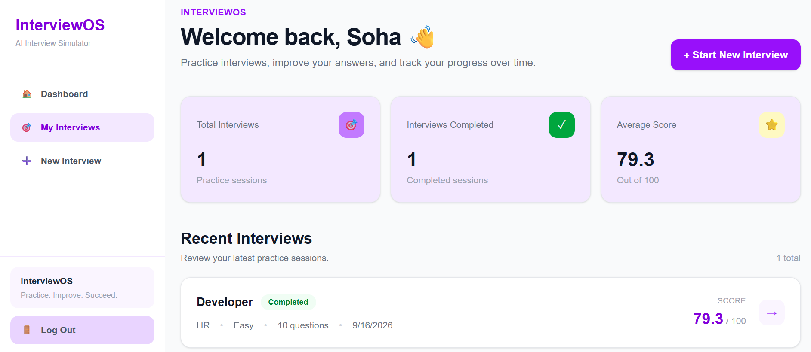

# InterviewOS 🎯

**InterviewOS** is a full-stack AI-powered interview preparation platform that helps students and developers simulate realistic technical and behavioral interviews, receive AI-powered feedback, and track their interview performance over time.

Built with **Next.js, TypeScript, PostgreSQL, Prisma, Auth.js, and Groq**, InterviewOS combines a production-style full-stack architecture with AI features to create an end-to-end interview preparation experience.

---

## 📸 Screenshots

### 🏠 Dashboard



The personalized dashboard provides an overview of interview activity, completed interviews, average performance, completion rate, and recent sessions.

---

### 🔐 Authentication

#### Login


#### Sign Up


Users can create an account and securely authenticate before accessing their interview data.

---

### 🎯 Create an Interview


Users can configure an interview based on:

* Target role
* Interview type
* Difficulty level

InterviewOS then generates a personalized set of interview questions.

---

### 🎤 Interview Session


The interactive interview environment presents questions one at a time and allows users to submit their answers as they progress through the session.

---

### 📊 Interview Results


After completing an interview, InterviewOS evaluates the responses and provides:

* Overall score
* Individual answer evaluation
* Strengths
* Weaknesses
* Personalized recommendations

---

### 📈 Interview History


Users can view previous interviews, their completion status, scores, difficulty, question count, and interview details.

---

## ✨ Features

### 🔐 Authentication

* User registration and login
* Secure password hashing with bcrypt
* Auth.js authentication
* JWT-based sessions
* Protected interview actions
* User-specific data access

### 🎯 Interview Generation

Users can create customized interview sessions based on:

* **Role** — Java Developer, Frontend Developer, etc.
* **Interview Type** — Technical, HR, Behavioral
* **Difficulty** — Easy, Medium, Hard

### 🤖 AI Question Generation

InterviewOS uses the **Groq API** to generate structured interview questions based on the selected interview configuration.

The AI generation system produces questions dynamically rather than relying on a static question bank.

### 💬 Interactive Interview Experience

* Question-by-question interview flow
* Answer submission
* Interview progress tracking
* Draft and completed interview states
* Persistent interview data

### 🧠 AI-Powered Evaluation

Completed interviews are evaluated using AI to provide structured feedback including:

* Answer scores
* Feedback
* Strengths
* Weaknesses
* Overall performance
* Improvement recommendations

### 📊 Performance Dashboard

The dashboard provides an overview of:

* Total interviews
* Completed interviews
* Average score
* Completion rate
* Recent interviews

### 📚 Interview History

Every interview is persisted so users can return to previous sessions and review their performance.

### 👤 User-Specific Data

InterviewOS associates every interview with the authenticated user.

This ensures that:

```text
User A
 ├── Interview 1
 ├── Interview 2
 └── Interview 3

User B
 ├── Interview 1
 └── Interview 2
```

Users only access their own interview data.

---

## 🛠️ Tech Stack

### Frontend

* **Next.js 16**
* **React 19**
* **TypeScript**
* **Tailwind CSS**
* **shadcn/ui**

### Backend

* **Next.js Server Actions**
* **Next.js API Routes**
* **Auth.js**
* **bcrypt**

### Database

* **PostgreSQL**
* **Prisma ORM**
* **Neon**

### AI

* **Groq API**
* Structured LLM outputs
* AI-generated interview questions
* AI-powered answer evaluation

### Deployment

* **Vercel**
* **Neon PostgreSQL**

---

## 🏗️ Architecture

```text
                         ┌─────────────────────┐
                         │        User         │
                         └──────────┬──────────┘
                                    │
                                    ▼
                         ┌─────────────────────┐
                         │     Next.js App     │
                         │ React + TypeScript  │
                         └──────────┬──────────┘
                                    │
                    ┌───────────────┼───────────────┐
                    │               │               │
                    ▼               ▼               ▼
             ┌────────────┐  ┌────────────┐  ┌────────────┐
             │  Auth.js   │  │   Groq AI  │  │  Server    │
             │    Auth    │  │   Engine   │  │  Actions   │
             └─────┬──────┘  └─────┬──────┘  └─────┬──────┘
                   │                │               │
                   └────────────────┼───────────────┘
                                    │
                                    ▼
                           ┌─────────────────┐
                           │  Prisma ORM     │
                           └────────┬────────┘
                                    │
                                    ▼
                           ┌─────────────────┐
                           │ Neon PostgreSQL │
                           └─────────────────┘
```

---

## 🔄 How InterviewOS Works

```text
Create Account
      ↓
     Login
      ↓
   Dashboard
      ↓
Create Interview
      ↓
Select Role + Type + Difficulty
      ↓
AI Generates Questions
      ↓
Start Interview
      ↓
Answer Questions
      ↓
Submit Interview
      ↓
AI Evaluates Answers
      ↓
Generate Results
      ↓
Review Feedback
      ↓
Track Performance
```

---

## 🗄️ Database Design

InterviewOS uses a relational PostgreSQL database managed through Prisma.

```text
User
 │
 └── Interview
       │
       ├── InterviewQuestion
       │       │
       │       └── Answer
       │
       └── InterviewResult
```

### Core Models

| Model               | Responsibility                              |
| ------------------- | ------------------------------------------- |
| `User`              | User account and authentication information |
| `Interview`         | Interview configuration and lifecycle       |
| `InterviewQuestion` | AI-generated interview questions            |
| `Answer`            | User answers and evaluation information     |
| `InterviewResult`   | Overall interview evaluation                |

---

## 🔐 Authentication Architecture

InterviewOS uses **Auth.js Credentials Authentication** with JWT sessions.

```text
Sign Up
   ↓
Password
   ↓
bcrypt Hash
   ↓
PostgreSQL
   ↓
Login
   ↓
Auth.js
   ↓
JWT Session
   ↓
session.user.id
   ↓
Authenticated Server Actions
```

Interview ownership is determined from the authenticated session rather than from client-provided user IDs.

This prevents users from simply passing another user's ID when creating or accessing interview data.

---

## 📁 Project Structure

```text
interview-os/
│
├── app/
│   ├── actions/
│   │   ├── ai-actions.ts
│   │   ├── answer-actions.ts
│   │   ├── evaluation-actions.ts
│   │   ├── interview-actions.ts
│   │   ├── question-actions.ts
│   │   └── user-actions.ts
│   │
│   ├── components/
│   │   ├── create-interview-form.tsx
│   │   ├── create-user-form.tsx
│   │   └── ...
│   │
│   ├── interview/
│   │   ├── new/
│   │   └── [id]/
│   │       ├── session/
│   │       └── result/
│   │
│   ├── interviews/
│   │   └── page.tsx
│   │
│   ├── login/
│   ├── signup/
│   ├── [...nextauth]/
│   │
│   └── page.tsx
│
├── lib/
│   └── prisma.ts
│
├── prisma/
│   ├── migrations/
│   └── schema.prisma
│
├── auth.ts
├── prisma.config.ts
├── next.config.ts
├── package.json
└── README.md
```

---

## 🚀 Running Locally

### Clone the repository

```bash
git clone <your-repository-url>
cd interview-os
```

### Install dependencies

```bash
npm install
```

### Configure environment variables

Create a `.env` file:

```env
DATABASE_URL="your-neon-database-url"
AUTH_SECRET="your-auth-secret"
GROQ_API_KEY="your-groq-api-key"
```

### Generate Prisma Client

```bash
npx prisma generate
```

### Run the application

```bash
npm run dev
```

Open:

```text
http://localhost:3000
```

---

## 🏭 Production Build

Generate the Prisma client and create the production build:

```bash
npm run build
```

Start the production application:

```bash
npm start
```

The production build uses:

```json
"build": "prisma generate && next build"
```

---

## ☁️ Deployment

InterviewOS is deployed using **Vercel** with **Neon PostgreSQL** as the production database.

```text
                    Vercel
                      │
                      ▼
              ┌───────────────┐
              │  Next.js App  │
              └───────┬───────┘
                      │
            ┌─────────┴─────────┐
            │                   │
            ▼                   ▼
      ┌───────────┐       ┌───────────┐
      │  Groq AI  │       │   Neon    │
      │    API    │       │ PostgreSQL│
      └───────────┘       └───────────┘
```

Production environment variables:

```text
DATABASE_URL
AUTH_SECRET
GROQ_API_KEY
```

---

## 🔒 Security Considerations

InterviewOS uses several server-side security practices:

* Passwords are stored as bcrypt hashes rather than plaintext.
* Authentication is handled through Auth.js.
* User identity is obtained from the authenticated session.
* Server Actions verify authentication before modifying protected data.
* Interview ownership is associated with the authenticated user's ID.
* API credentials are stored using environment variables.
* Sensitive environment variables are excluded from version control.

---

## 💡 Engineering Highlights

InterviewOS demonstrates practical experience with:

* Full-stack Next.js application architecture
* React server and client components
* Server Actions
* Authentication and authorization
* JWT sessions
* PostgreSQL relational data modeling
* Prisma ORM
* Database migrations
* AI/LLM API integration
* Structured AI responses
* Asynchronous server-side workflows
* User-specific data access
* Production environment configuration
* Vercel deployment
* Neon cloud databases
* Error handling and validation

---

## 🎯 Why I Built InterviewOS

Interview preparation platforms often separate practice, feedback, and progress tracking across different tools.

InterviewOS brings these workflows into a single application:

```text
Practice
   +
AI Feedback
   +
Performance Tracking
   =
InterviewOS
```

The project was built to explore how modern full-stack technologies and AI can work together to solve a practical problem while maintaining a scalable application architecture.

---

## 👩‍💻 Author

### Soha Ratnam

**B.Tech Computer Science Engineering**

Full-Stack Developer

[GitHub](https://github.com/SohaRatnam2005)

---

## ⭐ Project

If you find InterviewOS interesting, consider giving the repository a ⭐ on GitHub.
